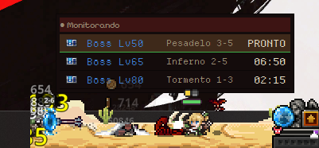

# TaskBar Hero Tracker 🏹

Widget flutuante de desktop que acompanha o **cooldown dos baús** do jogo
**TaskBar Hero** lendo o `Player.log`, mostra **para qual stage você deve ir** e
**avisa quando cada baú fica disponível** — tudo num overlay discreto, sempre no topo.



> Sem foco, o tracker some o header e a moldura e fica só a lista — discreto por cima do jogo.

---

## ✨ Recursos

- **Leitura automática** do `Player.log` (detecta cada baú dropado, a cada poucos segundos)
- **Cooldown ao vivo** por baú — baú cinza (Normal) 5 min, azul (Stage Boss) 7 min
- **"Pra onde ir"**: cada baú mostra o stage recomendado por nível (Lv1 → Lv80)
- **Alerta** quando o baú fica disponível: a linha fica **verde** e pulsa (+ som)
- **Overlay flutuante** sempre no topo, arrastável, estilo pixel do próprio jogo
- **Some o header/moldura sem foco** — fica só a lista, sem atrapalhar
- **Configurável**: adicione baús por um menu (ou ItemKey), níveis baixos inclusos para
  quem ainda está fraco, sons por tipo, volume, intervalo de leitura e caminho do log

## 🎯 Stages recomendados (por nível)

| Nível | Stage | Dificuldade | | Nível | Stage | Dificuldade |
|------|-------|-------------|-|------|-------|-------------|
| Lv1  | 1-1 | Normal   | | Lv30 | 3-8 | Normal   |
| Lv2  | 1-4 | Normal   | | Lv40 | 1-9 | Pesadelo |
| Lv3  | 1-8 | Normal   | | Lv50 | 3-5 | Pesadelo |
| Lv15 | 2-3 | Normal   | | Lv65 | 2-5 | Inferno  |
| Lv20 | 2-8 | Normal   | | Lv80 | 1-3 | Tormento |

## ⬇️ Download (Windows)

1. Baixe o `TaskBarHeroTracker.exe` na página de
   **[Releases](https://github.com/sostenesfreitas/taskbarhero-tracker/releases/latest)**.
2. Dê duplo-clique. O app encontra o `Player.log` sozinho; se não achar, clique no **⚙**
   e aponte o arquivo.

> O executável **não é assinado**, então o Windows SmartScreen pode avisar.
> Clique em **"Mais informações" → "Executar assim mesmo"**.

## 🕹️ Como usar

- Deixe a janela num canto da tela enquanto joga.
- Quando um baú some/é coletado, ele entra em cooldown e o tracker mostra o tempo restante.
- Quando libera, a linha fica **verde / PRONTO** — é hora de ir ao stage indicado.
- Clique na janela para mostrar o header (⚙ configurações, ✕ fechar); clique fora para
  voltar ao modo discreto.

## 🧠 Como funciona

O jogo (Unity) grava cada baú no log em:

```
%USERPROFILE%\AppData\LocalLow\TesseractStudio\TaskbarHero\Player.log
```

…em linhas como `GetBoxCount Success Count : 1 // ItemKey : 920651`. O tracker segue o
arquivo de forma incremental, faz o parse do `ItemKey` (que codifica tipo + nível),
aplica o cooldown a partir do momento da detecção e avisa quando zera.

## 🛠️ Rodar do código / build

```bash
python -m pip install -r requirements.txt
python main.py
```

Para gerar o `.exe`, veja **[build.md](build.md)** (PyInstaller, assets embutidos).
Testes: `python -m pytest -q`.

**Stack:** Python 3 · PySide6 (Qt) · PyInstaller.

## ⚠️ Aviso

Projeto **não oficial**, feito pela comunidade. Não afiliado aos desenvolvedores do
TaskBar Hero. Os ícones dos baús pertencem aos respectivos donos.
